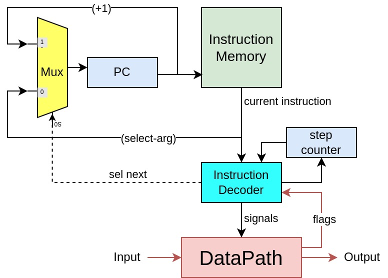
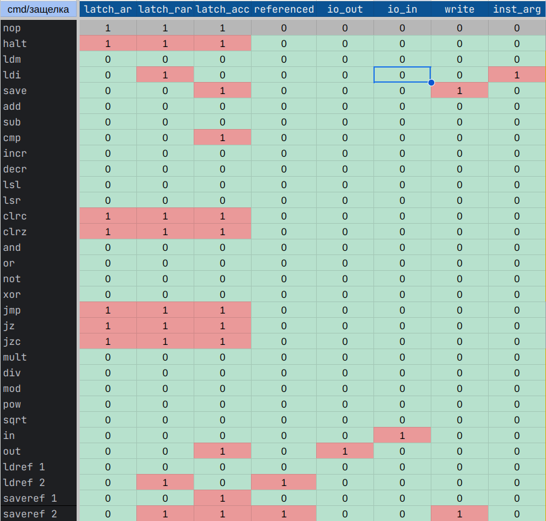

# Совкод (.ussr) Транслятор и модель

- `alg | acc | harv | hw | instr | binary | stream | port | pstr | prob1 | 8bit`
- Без усложнения

Задание к лабораторной [lab3-task.md](md_source/lab3-task.md).
Персональный вариант в файле [variant.md](md_source/variant.md).

## Язык программирования

Язык назовём Совкод (`☭★Cоветский код★☭`)
Синтаксис языка должен напоминать java/javascript/lua. Должен поддерживать математические выражения.

- необходимо объяснить, как происходит отображение больших выражений на регистры и память;
  Большое выражение раскладывается до простейших, а их результаты записываются в буферную область памяти.
- необходимо продемонстрировать работу транслятора в случае, если количество регистров недостаточно для реализации
  алгоритма.
  Такой ситуации не возникнет, так как доступный транслятору регистр всего один - acc.

### Типы данных

- цел - целочисленный (int)
- симв - символьный (char тип)
- строка (указатель на строку в памяти)
  того 6 типов данных

### Операции

- `+ - / *` (классические операции сложения, вычитания, деления и умножения соотв.)
- `% ** //` мат. операции остаток от деления, возведение в степень и взятие корня.
- `!` логическое отрицание
- `&` конъюнкция
- `|` дизъюнкция
- `^` xor
- `< > ==` отношения (меньше, больше и равно соответственно)
- `(переменная)++` `(переменная)--` операции инкремент и декремент соотв.
- `\>> (переменная)` чтение из потока ввода 1 символа
- `\<< (переменная)` запись в файл вывода 1 символа

### Выражения

#### `Если` Оператор условия (if)

* Оператор если выполняет код внутри блока {} при истинности логического выражения в скобках ().
* В случае ложности выражения, код в блоке иначе выполняется (если он присутствует).
* Пример:

> `если` _(...)_ { кол_во++; }  
> `иначе` { кол-во--; }

#### `Пока` - оператор цикла (while)

Оператор пока выполняет код внутри блока {} до тех пор, пока логическое выражение в скобках () истинно.
Пример:
> `пока` _((кол_во > 12) & (a + b == 12))_ {...}

`/*` _текст комментария_ `*/` - комментарии

#### Логическое выражение

Логические выражения могут содержать сравнения, логические операторы (&, |, !), и могут быть вложены в скобки.
Пример:
> ((кол_во > 12) & (a + b == 12))

#### Ограничения и фишки

> Сложение только целых чисел или строки и символа (символ добавится в конец строки)
> Максимальная длина строки 255 символов (как в Паскале)
> Строковые переменные можно увеличивать посимвольно и выводить
> Символьные можно вводить из потока ввода и выводить в поток вывода
> Целый тип - знаковый. Числа от (-2^31) до (2^31 - 1). Можно выводить

#### Комментарии:

* Комментарии начинаются с символа # и распространяются до конца строки.
* Пример:

> цел а = 5; `# Это комментарий`

### Формальное описание синтаксиса

<details><summary>Формальное описание Совкода по форме Бэкуса-Наура</summary>

``` ebnf
    <Совкод> ::= { <Объявление> | <Оператор> | <Комментарий> }
    
    <Объявление> ::= <Тип> <Идентификатор> {, <Идентификатор>} ;
    
    <Тип> ::= "цел" | "симв" | "строка"
    
    <Идентификатор> ::= <Буква> {<Буква> | <Цифра>}
    
    <Буква> ::= "a" | "b" | ... | "z" | "A" | "B" | ... | "Z" | "_"
    
    <Цифра> ::= "0" | "1" | ... | "9"
    
    <Оператор> ::= "если" "(" <Логическое_выражение> ")" "{" <Код> "}" ["иначе" "{" <Код> "}"]
     | "пока" "(" <Логическое_выражение> ")" "{" <Код> "}"
     | "#" <Текст_комментария>
     | <Выражение> ";"
    
    <Логическое_выражение> ::= <Сравнение> | <Логическое_выражение> "&" <Логическое_выражение>
     | <Логическое_выражение> "|" <Логическое_выражение>
     | "!" <Логическое_выражение>
    
    <Сравнение> ::= <Арифметическое_выражение> ("<" | ">" | "==") <Арифметическое_выражение>
    
    <Арифметическое_выражение> ::= <Терм> {"+" | "-" <Терм>}
    
    <Терм> ::= <Фактор> {"*" | "/" <Фактор>}
    
    <Фактор> ::= <Операнд> {"%" | "^" | "~" }
    
    <Операнд> ::= "(" <Логическое_выражение> ")"
     | <Идентификатор>
     | <Константа>
     | "\" ">>" "(" <Идентификатор> ")"
     | "\" "<<" "(" <Идентификатор> ")"
    
    <Константа> ::= <Целое> | <Вещественное> | <Логическое> | <Символьное>
    
    <Целое> ::= <Цифра> {<Цифра>}
    
    <Символьное> ::= "'" <Символ> "'"
    
    <Символ> ::= <Буква> | <Цифра> | <Спецсимвол>
    
    <Спецсимвол> ::= "#", "$"
    
    <Код> ::= { <Объявление> | <Оператор> }
    
    <Комментарий> ::= "#" <Текст_комментария>
    
    <Текст_комментария> ::= <Любой_текст_комментария>
    
    <Любой_текст_комментария> ::= {<Любой_символ>}
    
    <Любой_символ> ::= <Буква> | <Цифра>
    
     <
     Спецсимвол> | " " | "," | ";" | "(" | ")" | "{" | "}" | "'" | "\" | "=" | "!" | "&" | "|" | "<" | ">" | "+" | "-" | "*" | "/" | "%" | "^"
     ... Как-то так
```

</details>

Таким образом, семантика ☭★Совкода★☭ определяет порядок выполнения кода, правила объявления переменных,
структуру условных операторов и циклов, а также различные операции, которые могут быть использованы в программах на этом
языке.

## Транслятор Совкода

`translator.py <путь до исходника .ussr> <имя бинарника> <путь куда записать пояснение>`

### Входные данные

* Имя файла с исходным кодом в текстовом виде.
* Имя файла для сохранения полученного машинного кода.
* Путь до места записи пояснений (текстового представления бинарника с пояснениями)

### Выходные данные

* Сначала отрабатывают лексер и парсер, возвращая программу как набор токенов с разной степенью вложенности
* (Да, я заморочился и сделал на yacc)
* Затем транслятор рекурсивно обходит каждую команду, полученную из парсера.
* Результат каждого вложенного токена записывается в соответствующую ячейку буфера и терм упрощается
  до ссылки на результат
* Таким образом в конце каждое выражение представляется как набор чтений операций и записей в буфер (или переменную)
* Это именно то что нужно для аккумуляторной архитектуры эмулятора
* В файл записывается байткод программы, а в .log файл их текстовое представление с мнемониками
* В случае ошибки в коде компилятор поругается на место, где обнаружена проблема. Никаких внятных пояснений, по
  типу "вы забыли закрыть скобки" пока не реализовано. Возможно будет добавлено в будущем.

### Основные этапы компиляции

[Translator.py](translator/translator.py)

* Трансформирование текста в последовательность значимых термов. [Lexer.py](translator/s_lexer.py)
* Парсинг программы. [Parser.py](translator/s_parser.py)
* Представление программы в ассемблерном виде и конвертация в последовательность машинного кода
* Генерация машинного кода в случае, если предыдущие этапы завершились без
  ошибок

### Правила генерации машинного кода:

В Совкоде есть первичные операции. (запись в переменную - присвоение, условный оператор, цикл и ввод и вывод и IO
device)

('while', ('<', ('identifier', 'a'), ('literal', '100')),[(do_smth))]

Эти первичные операции обрабатываются в методе translate. Все вложенные операции. Передаются в метод simplify который
рекурсивно собирает последовательность команд которые должны привести к записи результат выражения в буферную ячейку,
которая и возвращается на уровень выше.

В случае с условными операторами и операторами циклов транслятор оставляет промис (операция nop) на место где должен
быть
jump, и проставляет его (изменяет инструкцию) когда доходит до соответствующего места перехода.

| Код инструкции | Программа | Машинный код |
|----------------|-----------|--------------|
| n              | [         | jz (k+1)     |
| ...            | ...       | ...          |
| k              | ]         | jmp n        |
| k+1            | ...       | ...          |

Никаких отображений регистров на память нет, так как нет самих регистров кроме аккумулятора.

## Система команд

Аргумент может быть

* NoneArg -- Не требуется
* DmemArg -- Указатель на память данных (dmem)
* PmemArg -- Pointer to program-memory (pmem)
* ValueArg -- Аргумент непосредственно
* IOPort -- Указатель на порт ввода вывода

| код | мнемоника | тип  аргумента | 	тактов |                     	расшифровка	действия                     | подробно                                                      |
|:----|:---------:|:--------------:|:-------:|:-------------------------------------------------------------:|---------------------------------------------------------------|
| 0   |   nop	    |    NoneArg	    |   1 	   |                       операция простоя	                       | так как нет прерываний - определяет ошибку работы             |
| 1   |   halt	   |    NoneArg	    |   0	    |                       сигнал остановки	                       |                                                               |
| 2   |   ldm	    |    DmemArg	    |   1	    |            загрузить знач из памяти данных в acc	             | acc = dmem[arg + (?ref acc)]; c = const; z = (dmem[arg] == 0) |
| 3   |   ldi	    |    ValueArg    |   	1    |            загрузить знач из памяти команд в acc	             | acc = arg; c = const; z = (arg == 0)                          |
| 4   |   save	   |    DmemArg	    |   	1    |       выгрузить значение аккумулятора в ячейку памяти	        | dmem[arg] = acc	                                              |
| 5   |   add	    |    DmemArg	    |   1	    |          добавить значение из ячейки к аккумулятору	          | acc + dmem[arg]                                               |
| 6   |   sub	    |    DmemArg	    |   1	    |           вычесть значение ячейки из аккумулятора	            | acc - dmem[arg]                                               |
| 7   |   cmp	    |    DmemArg	    |    1    |           проверка аккумулятора, выставить регистры           | 	z = (0 == acc); c = (acc < 0), acc > 0 ? 1 : 0               |
| 8   |   incr	   |    NoneArg	    |   1	    |             инкрементирует значение аккумулятора	             | x                                                             |
| 9   |   decr	   |    NoneArg	    |   1	    |             декрементирует значение аккумулятора	             | x                                                             |
| A   |   lsl	    |    ValueArg    |   1	    |    бит. сдвиг влево на 16 бит, устанавливается флаг c в с	    | x                                                             |
| B   |   lsr	    |    ValueArg    |   1	    |    бит. сдвиг вправо на 16 бит, устанавливается флаг c в	     | x                                                             |
| C   |   clrc	   |    NoneArg	    |   1	    |            сбрасывает значение флага переполнения	            | x                                                             |
| D   |   clrz	   |    NoneArg	    |   1	    |             сбрасывает значение нулевого флага		              | x                                                             |
| E   |   and	    |    DmemArg	    |   1	    |                       логическое и acc	                       | acc & dmem[arg]                                               |
| F   |    or     |    DmemArg	    |   1	    |                      логическое или    	                      | acc  \| dmem[arg]                                             |
| 10  |   not	    |    NoneArg	    |   1	    |                      логическое не acc	                       | !acc                                                          |
| 11  |   xor	    |    DmemArg	    |   1	    |                      логический xor acc	                      | acc xor dmem[arg]	                                            |
| 12  |   jmp	    |    PmemArg	    |   1	    |                  совершить переход на pmem	                   | pc = pmem[arg]                                                |
| 13  |    jz	    |    PmemArg	    |   1	    |        переход на pmem при установленном zero флаге 1	        | z == 1 ? pc = pmem[arg]                                       |
| 14  |   jzc	    |    PmemArg	    |   1	    | переход на pmem если acc меньше или равен 0 (z = 1 or c = 1)	 | z == 1 or c == 1 ? pc = pmem[arg]	                            |
| 15  |   mult	   |    DmemArg	    |   1	    |        умножить аккумулятор на знанч. из ячейки пам.	         | acc = acc * dmem[arg]                                         |
| 16  |   dev	    |    DmemArg	    |   1	    |        разделить аккумулятор на знанч. из ячейки пам.	        | acc = acc / dmem[arg]                                         |
| 17  |   mod	    |    DmemArg	    |   1	    |       остаток от деления аккумулятора на знанч.ячейки	        | acc = acc % dmem[arg]                                         |
| 18  |   pow	    |    DmemArg	    |   1 	   |        возвести аккумулятор в степень из ячейки пам.	         | acc ^ dmem[arg]                                               |
| 19  |   sqrt	   |    NoneArg	    |   1	    |             подсчитать корень знач. аккумулятора	             | sqrt(acc)	                                                    |
| 1A  |    in	    |    IOport	     |   1	    |         Ввод символьного значения с внешнего устр-ва	         | input >> dmem[arg]                                            |
| 1B  |   out	    |    IOport	     |   1 	   |        Вывод символьного значения на внешнее устр-во	         | dmem[arg] >> output                                           |
| 1C  |   ldref   |    DmemArg     |    2    |               Относительная загрузка из памяти                | acc = dmem[dmem[arg]]                                         |
| 1D  |  saveref  |    DmemArg     |    2    |               Относительное сохранение в память               | dmem[dmem[arg]] = acc                                         |

### Кодирование инструкций

* Машинные коды инструкций представлены в таблице.
* Машинное слово: 32 бита
    * Первые 16 бит (2 байта): Код команды
    * Оставшиеся 16 бит (2 байта): Аргумент

## Структура памяти

* Память инструкций
    * Размер: 65536 ячеек
    * Формат каждой ячейки: 32 бита (4 байта)
        * Первые 16 бит (2 байта): Код команды
        * Оставшиеся 16 бит (2 байта): Аргумент
* Память данных
    * Размер: 65536 ячеек
    * Формат каждой ячейки: 32 бита (4 байта)
        * Big-endian
        * Знаковое представление
        * Линейное адресное пространство
        * Реализуется списком чисел
* Аккумулятор
    * Размер: 32 бита (4 байта)
* Порты ввода-вывода
    * Пространство портов ввода-вывода состоит из 256 индивидуально адресуемых 16-битных ячеек (портов)
    * Адрес 1 байт
    * Размер каждого порта: 16 бит (2 байта)
    * Установлено 2 устройства
    * Порт ввода - Запись не дает никакого эффекта
    * Порт вывода - Чтение всегда возвращает 0
* Общая информация
    * Машинное слово: 32 бита (4 байта)

```text
       Registers
+-------------------------------+
| acc                           |
+-------------------------------+

       Instruction memory
+-------------------------------+
| 0000 : jmp N                  |
| 0001 : command                |
|     ...                       |
| 00FD : HALT                   |
+-------------------------------+

          Data memory
+-------------------------------+
| 0000 : variable а (int)       |
| 0001 : variable б (str)       |
|    ...                        |
| 002E : variable в (int)       |
| 002F : variable г (char)      |
|    ...                        |
| b+0 : buffer var 112 (int)    |
| b+1 : buffer var 113 (int)    |
|    ...                        |
+-------------------------------+
```

### Тонкости реализации

1. Транслятор подсчитывает, сколько памяти необходимо под хранение переменных.
   Неиспользованная часть адресного пространства - буферная.
2. В "буферной памяти" мы будем хранить промежуточные результаты вычислений
3. Для возможности подсчёта больших выражений унарные операции перезаписывают ячейку буфера.
   Используемые при подсчёте значения переменных предварительно выгружаются в буфер.
4. После выполнения операции и записи переменной в переменную считается освобождённым и используется
   с начала.
5. Иных вариантов оптимизации памяти и решения проблемы нехватки таковой я не вижу, т.к.
   нет ни кучи, ни стека, ни других регистров.**
6. Макс. длина строки 255 символов -> 255 регистров (+1 служебный регистр). Как в pascal. Именно столько выделит
   аллокатор под ячейку, которую необходимо ввести.

## Процессор (Эмулятор)

[Emulator.py](emulator/emulator.py)

Данная часть лабораторной оказалась намного проще чем транслятор (я на тот момент ещё не знал, что переусложнил задачу)

### Консольное приложение

`python3 sovcode.py <code_file> <input_file> <debug_lvl>`

### Входные данные

Имя бинарного файла, аргументы программы и (опционально) уровень логирования (debug, info, warning, critical)

### Выходные данные

* В стандартный поток вывода записывается вывод программы
* В .log файл записывается вывод состояний процессора после каждой инструкции и другие логи

### Порядок обработки бинарного файла

* Из файла читаются блоки по 4 байта (32 бит)
  и записываются в массив инструкций. (как целочисленные значения)
* Затем запускается метод эмуляции (emulation)
* В этом методе инициализируются Control Unit и Data Path, в цикле мы вызываем метод decode_and_execute_instruction()
  control unit-а, и выводим состояние процессора в логгер. По
* Control unit получает инструкцию из памяти инструкция. Разбивает её на opcode и аргумент. А далее выставляет
  соответствующие сигналы Signals. Вызывается метод tick, эмулируя работу тактового генератора и передавая сигналы DP
* Работа Data Pass происходит в методе run(). Происходит обращение к памяти (или чтение из порта ввода), работа АЛУ
  выставление флагов и запись в память (или вывод).
* В случае если операция выполняется за несколько тактов сигналы выставляются снова и происходит ещё один tick

### ControlUnit



### DataPath


### Регистры:

* PC — счетчик команд
* AR — регистр адреса операнда
* RAR — альтернативный регистр адреса (оператора с относительной адресацией)
* C — флаг переноса/заёма
* Z — флаг нуля

### Сигналы

Набор сигналов передаваемых из Control unit (декодера) в Data Path передаётся в виде сущности:

```python
class Signals:
    def __init__(self):
        self.arg: int = 0
        self.latch_ar: bool = False
        self.latch_rar: bool = False
        self.latch_acc: bool = False
        self.referenced: bool = False
        self.io_out: bool = False
        self.io_in: bool = False
        self.write: bool = False
        self.inst_arg: bool = False
        self.alu_op: int
```



## Тестирование

Тестирование выполняется при помощи golden test-ов.

1. Тесты реализованы в: [integration_test.py](../integration_test.py). Конфигурации:
    - [cat.yml](../golden/cat.yml) - имитирует команду cat
    - [hello.yml](../golden/hello.yml) - печатает hello world в stdout
    - [hello_user_name.yml](../golden/hello_user_name.yml) - Спрашивает имя, приветствует.
    - [math.yml](../golden/math.yml) - Показывает математические возможности языка Совкод
    - [prob1.yml](../golden/prob1.yml) - Оптимальное решение задачи prob1
    - [prob1s.yml](../golden/prob1s.yml) - Решение prob1 в лоб (показывает работу с циклами и условиями)

Запустить тесты: `poetry run pytest . -v`

Обновить конфигурацию golden tests:  `poetry run pytest . -v --update-goldens`

## CI

CI при помощи Github Action:

```yml
name: Python CI

on:
  push:
    branches:
      - master
    paths:
      - ".github/workflows/*"
      - "/**"
  pull_request:
    branches:
      - master
    paths:
      - ".github/workflows/*"
      - "/**"

defaults:
  run:
    working-directory: ./

jobs:
  test:
    runs-on: ubuntu-latest

    steps:
      - name: Checkout code
        uses: actions/checkout@v4

      - name: Set up Python
        uses: actions/setup-python@v4
        with:
          python-version: 3.11

      - name: Install dependencies
        run: |
          python -m pip install --upgrade pip
          pip install poetry
          poetry install

      - name: Run tests and collect coverage
        run: |
          poetry run coverage run -m pytest .
          poetry run coverage report -m
        env:
          CI: true

  lint:
    runs-on: ubuntu-latest

    steps:
      - name: Checkout code
        uses: actions/checkout@v4

      - name: Set up Python
        uses: actions/setup-python@v4
        with:
          python-version: 3.11

      - name: Install dependencies
        run: |
          python -m pip install --upgrade pip
          pip install poetry
          poetry install

      - name: Check code formatting with Ruff
        run: poetry run ruff format --check .

      - name: Run Ruff linters
        run: poetry run ruff check .
```

Где:

- `poetry` -- управления зависимостями для языка программирования Python.
- `coverage` -- формирование отчёта об уровне покрытия исходного кода.
- `pytest` -- утилита для запуска тестов.
- `ruff` -- утилита для форматирования и проверки стиля кодирования.

## Пример

Полный цикл на примере math.ussr

### Исходный код

``` ussr
  цел рублей = 5000;
  цел курсБиткойна = 4805444; /* руб за биткойн */
  цел курс2010 = -30 + 45;    /* 15 руб за биткойн */
  цел инфляция = 117 % 1000;  /* процентов */
  цел тысРублейУпущено = 0;   /* тыс рублей могла бы быть сейчас */
                              /* Это всё просто прикол. Я не серьёзно */

  цел рубТогда = рублей * (//10000) / (100 + инфляция);   /* 2304 руб */
  цел биткойнов = рубТогда / курс2010;                    /* 153 биткойна */

  тысРублейУпущено = (курсБиткойна / 10 ** 3) * биткойнов; /* 735165 */
  << тысРублейУпущено;        /* Теперь можно плакать */
```

Когда код записал в math.ussr запускаем транслятор командой
`python /translator/translator.py ../examples/math.ussr ./out/binary ./out/log.log`

### Машинный код

<details><summary>binary</summary>

0 000000000000110000000000000000 #LDI 0
1 000000000010100000000000010000 #LSL 16
2 000000000000110001001110001000 #LDI 5000
3 000000000001000000000000001000 #SAVE 8
4 000000000000100000000000001000 #LDM 8
5 000000000001000000000000000000 #SAVE 0
6 000000000000110000000001001001 #LDI 73
7 000000000010100000000000010000 #LSL 16
8 000000000000110101001101000100 #LDI 21316
9 000000000001000000000000001000 #SAVE 8
10 000000000000100000000000001000 #LDM 8
11 000000000001000000000000000001 #SAVE 1
12 000000000000110000000000000000 #LDI 0
13 000000000010100000000000010000 #LSL 16
14 000000000000110000000000011110 #LDI 30
15 000000000001000000000000001000 #SAVE 8
16 000000000010100000000000000000 #LSL 0
17 000000000010100000000000000000 #LSL 0
18 000000000001100000000000001000 #SUB 8
19 000000000001000000000000001000 #SAVE 8
20 000000000000110000000000000000 #LDI 0
21 000000000010100000000000010000 #LSL 16
22 000000000000110000000000101101 #LDI 45
23 000000000001000000000000001001 #SAVE 9
24 000000000000100000000000001000 #LDM 8
25 000000000001010000000000001001 #ADD 9
26 000000000001000000000000001010 #SAVE 10
27 000000000000100000000000001010 #LDM 10
28 000000000001000000000000000010 #SAVE 2
29 000000000000110000000000000000 #LDI 0
30 000000000010100000000000010000 #LSL 16
31 000000000000110000000001110101 #LDI 117
32 000000000001000000000000001000 #SAVE 8
33 000000000000110000000000000000 #LDI 0
34 000000000010100000000000010000 #LSL 16
35 000000000000110000001111101000 #LDI 1000
36 000000000001000000000000001001 #SAVE 9
37 000000000000100000000000001000 #LDM 8
38 000000000101110000000000001001 #MOD 9
39 000000000001000000000000001010 #SAVE 10
40 000000000000100000000000001010 #LDM 10
41 000000000001000000000000000011 #SAVE 3
42 000000000000110000000000000000 #LDI 0
43 000000000010100000000000010000 #LSL 16
44 000000000000110000000000000000 #LDI 0
45 000000000001000000000000001000 #SAVE 8
46 000000000000100000000000001000 #LDM 8
47 000000000001000000000000000100 #SAVE 4
48 000000000000100000000000000000 #LDM 0
49 000000000001000000000000001000 #SAVE 8
50 000000000000110000000000000000 #LDI 0
51 000000000010100000000000010000 #LSL 16
52 000000000000110010011100010000 #LDI 10000
53 000000000001000000000000001001 #SAVE 9
54 000000000000100000000000001001 #LDM 9
55 000000000110010000000000000000 #SQRT 0
56 000000000001000000000000001001 #SAVE 9
57 000000000000100000000000001000 #LDM 8
58 000000000101010000000000001001 #MULT 9
59 000000000001000000000000001010 #SAVE 10
60 000000000000110000000000000000 #LDI 0
61 000000000010100000000000010000 #LSL 16
62 000000000000110000000001100100 #LDI 100
63 000000000001000000000000001011 #SAVE 11
64 000000000000100000000000000011 #LDM 3
65 000000000001000000000000001100 #SAVE 12
66 000000000000100000000000001011 #LDM 11
67 000000000001010000000000001100 #ADD 12
68 000000000001000000000000001101 #SAVE 13
69 000000000000100000000000001010 #LDM 10
70 000000000101100000000000001101 #DIV 13
71 000000000001000000000000001110 #SAVE 14
72 000000000000100000000000001110 #LDM 14
73 000000000001000000000000000101 #SAVE 5
74 000000000000100000000000000101 #LDM 5
75 000000000001000000000000001000 #SAVE 8
76 000000000000100000000000000010 #LDM 2
77 000000000001000000000000001001 #SAVE 9
78 000000000000100000000000001000 #LDM 8
79 000000000101100000000000001001 #DIV 9
80 000000000001000000000000001010 #SAVE 10
81 000000000000100000000000001010 #LDM 10
82 000000000001000000000000000110 #SAVE 6
83 000000000000100000000000000001 #LDM 1
84 000000000001000000000000001000 #SAVE 8
85 000000000000110000000000000000 #LDI 0
86 000000000010100000000000010000 #LSL 16
87 000000000000110000000000001010 #LDI 10
88 000000000001000000000000001001 #SAVE 9
89 000000000000110000000000000000 #LDI 0
90 000000000010100000000000010000 #LSL 16
91 000000000000110000000000000011 #LDI 3
92 000000000001000000000000001010 #SAVE 10
93 000000000000100000000000001001 #LDM 9
94 000000000110000000000000001010 #POW 10
95 000000000001000000000000001011 #SAVE 11
96 000000000000100000000000001000 #LDM 8
97 000000000101100000000000001011 #DIV 11
98 000000000001000000000000001100 #SAVE 12
99 000000000000100000000000000110 #LDM 6
100 000000000001000000000000001101 #SAVE 13
101 000000000000100000000000001100 #LDM 12
102 000000000101010000000000001101 #MULT 13
103 000000000001000000000000001110 #SAVE 14
104 000000000000100000000000001110 #LDM 14
105 000000000001000000000000000100 #SAVE 4
106 000000000000100000000000000100 #LDM 4
107 000000000110110000000000000001 #OUT 1
108 000000000000010000000000000000 #HALT 0

</details>

Находим бинарный файл. Запускаем эмулятор, указывая путь к бинарнику.
`python /emulator/emulator.py ./out/binary ./inputs.txt debug`

### Стандартный вывод эмулятора

<details><summary>emulator stdout</summary>

Эмулятор ЭВМ исполнителя Совкода
int output: 735165
instr_counter: 108 , ticks: 108
</details>

### Лог эмулятора

<details><summary>emulator log</summary>

INFO emulator:main Got instructions and user input
INFO emulator:emulation Starting emulation
DEBUG emulator:emulation TICK:   0 PC:   0 AR:   0 RAR:   0 MEM_OUT: [] ACC: 0 ldi0
DEBUG emulator:emulation TICK:   1 PC:   1 AR:   0 RAR:   0 MEM_OUT: [] ACC: 0 lsl16
DEBUG emulator:emulation TICK:   2 PC:   2 AR:  16 RAR:   0 MEM_OUT: [] ACC: 0 ldi5000
DEBUG emulator:emulation TICK:   3 PC:   3 AR: 5000 RAR:   0 MEM_OUT: [] ACC: 5000 save8
DEBUG emulator:emulation TICK:   4 PC:   4 AR:   8 RAR:   0 MEM_OUT: [] ACC: 5000 ldm8
DEBUG emulator:emulation TICK:   5 PC:   5 AR:   8 RAR: 5000 MEM_OUT: [] ACC: 5000 save0
DEBUG emulator:emulation TICK:   6 PC:   6 AR:   0 RAR:   0 MEM_OUT: [] ACC: 5000 ldi73
DEBUG emulator:emulation TICK:   7 PC:   7 AR:  73 RAR:   0 MEM_OUT: [] ACC: 73 lsl16
DEBUG emulator:emulation TICK:   8 PC:   8 AR:  16 RAR: 4784128 MEM_OUT: [] ACC: 4784128 ldi21316
DEBUG emulator:emulation TICK:   9 PC:   9 AR: 21316 RAR: 4784128 MEM_OUT: [] ACC: 4805444 save8
DEBUG emulator:emulation TICK:  10 PC:  10 AR:   8 RAR: 5000 MEM_OUT: [] ACC: 4805444 ldm8
DEBUG emulator:emulation TICK:  11 PC:  11 AR:   8 RAR: 4805444 MEM_OUT: [] ACC: 4805444 save1
DEBUG emulator:emulation TICK:  12 PC:  12 AR:   1 RAR:   0 MEM_OUT: [] ACC: 4805444 ldi0
DEBUG emulator:emulation TICK:  13 PC:  13 AR:   0 RAR:   0 MEM_OUT: [] ACC: 4784128 lsl16
DEBUG emulator:emulation TICK:  14 PC:  14 AR:  16 RAR:   0 MEM_OUT: [] ACC: 0 ldi30
DEBUG emulator:emulation TICK:  15 PC:  15 AR:  30 RAR:   0 MEM_OUT: [] ACC: 30 save8
DEBUG emulator:emulation TICK:  16 PC:  16 AR:   8 RAR: 4805444 MEM_OUT: [] ACC: 30 lsl0
DEBUG emulator:emulation TICK:  17 PC:  17 AR:   0 RAR: 1966080 MEM_OUT: [] ACC: 1966080 lsl0
DEBUG emulator:emulation TICK:  18 PC:  18 AR:   0 RAR:   0 MEM_OUT: [] ACC: 0 sub8
DEBUG emulator:emulation TICK:  19 PC:  19 AR:   8 RAR: 4294967266 MEM_OUT: [] ACC: 4294967266 save8
DEBUG emulator:emulation TICK:  20 PC:  20 AR:   8 RAR:  30 MEM_OUT: [] ACC: 4294967266 ldi0
DEBUG emulator:emulation TICK:  21 PC:  21 AR:   0 RAR:  30 MEM_OUT: [] ACC: 4294901760 lsl16
DEBUG emulator:emulation TICK:  22 PC:  22 AR:  16 RAR:   0 MEM_OUT: [] ACC: 0 ldi45
DEBUG emulator:emulation TICK:  23 PC:  23 AR:  45 RAR:   0 MEM_OUT: [] ACC: 45 save9
DEBUG emulator:emulation TICK:  24 PC:  24 AR:   9 RAR:   0 MEM_OUT: [] ACC: 45 ldm8
DEBUG emulator:emulation TICK:  25 PC:  25 AR:   8 RAR: 4294967266 MEM_OUT: [] ACC: 4294967266 add9
DEBUG emulator:emulation TICK:  26 PC:  26 AR:   9 RAR:  15 MEM_OUT: [] ACC: 15 save10
DEBUG emulator:emulation TICK:  27 PC:  27 AR:  10 RAR:   0 MEM_OUT: [] ACC: 15 ldm10
DEBUG emulator:emulation TICK:  28 PC:  28 AR:  10 RAR:  15 MEM_OUT: [] ACC: 15 save2
DEBUG emulator:emulation TICK:  29 PC:  29 AR:   2 RAR:   0 MEM_OUT: [] ACC: 15 ldi0
DEBUG emulator:emulation TICK:  30 PC:  30 AR:   0 RAR:   0 MEM_OUT: [] ACC: 0 lsl16
DEBUG emulator:emulation TICK:  31 PC:  31 AR:  16 RAR:   0 MEM_OUT: [] ACC: 0 ldi117
DEBUG emulator:emulation TICK:  32 PC:  32 AR: 117 RAR:   0 MEM_OUT: [] ACC: 117 save8
DEBUG emulator:emulation TICK:  33 PC:  33 AR:   8 RAR: 4294967266 MEM_OUT: [] ACC: 117 ldi0
DEBUG emulator:emulation TICK:  34 PC:  34 AR:   0 RAR: 4294967266 MEM_OUT: [] ACC: 0 lsl16
DEBUG emulator:emulation TICK:  35 PC:  35 AR:  16 RAR:   0 MEM_OUT: [] ACC: 0 ldi1000
DEBUG emulator:emulation TICK:  36 PC:  36 AR: 1000 RAR:   0 MEM_OUT: [] ACC: 1000 save9
DEBUG emulator:emulation TICK:  37 PC:  37 AR:   9 RAR:  45 MEM_OUT: [] ACC: 1000 ldm8
DEBUG emulator:emulation TICK:  38 PC:  38 AR:   8 RAR: 117 MEM_OUT: [] ACC: 117 mod9
DEBUG emulator:emulation TICK:  39 PC:  39 AR:   9 RAR: 117 MEM_OUT: [] ACC: 117 save10
DEBUG emulator:emulation TICK:  40 PC:  40 AR:  10 RAR:  15 MEM_OUT: [] ACC: 117 ldm10
DEBUG emulator:emulation TICK:  41 PC:  41 AR:  10 RAR: 117 MEM_OUT: [] ACC: 117 save3
DEBUG emulator:emulation TICK:  42 PC:  42 AR:   3 RAR:   0 MEM_OUT: [] ACC: 117 ldi0
DEBUG emulator:emulation TICK:  43 PC:  43 AR:   0 RAR:   0 MEM_OUT: [] ACC: 0 lsl16
DEBUG emulator:emulation TICK:  44 PC:  44 AR:  16 RAR:   0 MEM_OUT: [] ACC: 0 ldi0
DEBUG emulator:emulation TICK:  45 PC:  45 AR:   0 RAR:   0 MEM_OUT: [] ACC: 0 save8
DEBUG emulator:emulation TICK:  46 PC:  46 AR:   8 RAR: 117 MEM_OUT: [] ACC: 0 ldm8
DEBUG emulator:emulation TICK:  47 PC:  47 AR:   8 RAR:   0 MEM_OUT: [] ACC: 0 save4
DEBUG emulator:emulation TICK:  48 PC:  48 AR:   4 RAR:   0 MEM_OUT: [] ACC: 0 ldm0
DEBUG emulator:emulation TICK:  49 PC:  49 AR:   0 RAR: 5000 MEM_OUT: [] ACC: 5000 save8
DEBUG emulator:emulation TICK:  50 PC:  50 AR:   8 RAR:   0 MEM_OUT: [] ACC: 5000 ldi0
DEBUG emulator:emulation TICK:  51 PC:  51 AR:   0 RAR:   0 MEM_OUT: [] ACC: 0 lsl16
DEBUG emulator:emulation TICK:  52 PC:  52 AR:  16 RAR:   0 MEM_OUT: [] ACC: 0 ldi10000
DEBUG emulator:emulation TICK:  53 PC:  53 AR: 10000 RAR:   0 MEM_OUT: [] ACC: 10000 save9
DEBUG emulator:emulation TICK:  54 PC:  54 AR:   9 RAR: 1000 MEM_OUT: [] ACC: 10000 ldm9
DEBUG emulator:emulation TICK:  55 PC:  55 AR:   9 RAR: 10000 MEM_OUT: [] ACC: 10000 sqrt0
DEBUG emulator:emulation TICK:  56 PC:  56 AR:   0 RAR: 100 MEM_OUT: [] ACC: 100 save9
DEBUG emulator:emulation TICK:  57 PC:  57 AR:   9 RAR: 10000 MEM_OUT: [] ACC: 100 ldm8
DEBUG emulator:emulation TICK:  58 PC:  58 AR:   8 RAR: 5000 MEM_OUT: [] ACC: 5000 mult9
DEBUG emulator:emulation TICK:  59 PC:  59 AR:   9 RAR: 500000 MEM_OUT: [] ACC: 500000 save10
DEBUG emulator:emulation TICK:  60 PC:  60 AR:  10 RAR: 117 MEM_OUT: [] ACC: 500000 ldi0
DEBUG emulator:emulation TICK:  61 PC:  61 AR:   0 RAR: 117 MEM_OUT: [] ACC: 458752 lsl16
DEBUG emulator:emulation TICK:  62 PC:  62 AR:  16 RAR:   0 MEM_OUT: [] ACC: 0 ldi100
DEBUG emulator:emulation TICK:  63 PC:  63 AR: 100 RAR:   0 MEM_OUT: [] ACC: 100 save11
DEBUG emulator:emulation TICK:  64 PC:  64 AR:  11 RAR:   0 MEM_OUT: [] ACC: 100 ldm3
DEBUG emulator:emulation TICK:  65 PC:  65 AR:   3 RAR: 117 MEM_OUT: [] ACC: 117 save12
DEBUG emulator:emulation TICK:  66 PC:  66 AR:  12 RAR:   0 MEM_OUT: [] ACC: 117 ldm11
DEBUG emulator:emulation TICK:  67 PC:  67 AR:  11 RAR: 100 MEM_OUT: [] ACC: 100 add12
DEBUG emulator:emulation TICK:  68 PC:  68 AR:  12 RAR: 217 MEM_OUT: [] ACC: 217 save13
DEBUG emulator:emulation TICK:  69 PC:  69 AR:  13 RAR:   0 MEM_OUT: [] ACC: 217 ldm10
DEBUG emulator:emulation TICK:  70 PC:  70 AR:  10 RAR: 500000 MEM_OUT: [] ACC: 500000 dev13
DEBUG emulator:emulation TICK:  71 PC:  71 AR:  13 RAR: 2304 MEM_OUT: [] ACC: 2304 save14
DEBUG emulator:emulation TICK:  72 PC:  72 AR:  14 RAR:   0 MEM_OUT: [] ACC: 2304 ldm14
DEBUG emulator:emulation TICK:  73 PC:  73 AR:  14 RAR: 2304 MEM_OUT: [] ACC: 2304 save5
DEBUG emulator:emulation TICK:  74 PC:  74 AR:   5 RAR:   0 MEM_OUT: [] ACC: 2304 ldm5
DEBUG emulator:emulation TICK:  75 PC:  75 AR:   5 RAR: 2304 MEM_OUT: [] ACC: 2304 save8
DEBUG emulator:emulation TICK:  76 PC:  76 AR:   8 RAR: 5000 MEM_OUT: [] ACC: 2304 ldm2
DEBUG emulator:emulation TICK:  77 PC:  77 AR:   2 RAR:  15 MEM_OUT: [] ACC: 15 save9
DEBUG emulator:emulation TICK:  78 PC:  78 AR:   9 RAR: 100 MEM_OUT: [] ACC: 15 ldm8
DEBUG emulator:emulation TICK:  79 PC:  79 AR:   8 RAR: 2304 MEM_OUT: [] ACC: 2304 dev9
DEBUG emulator:emulation TICK:  80 PC:  80 AR:   9 RAR: 153 MEM_OUT: [] ACC: 153 save10
DEBUG emulator:emulation TICK:  81 PC:  81 AR:  10 RAR: 500000 MEM_OUT: [] ACC: 153 ldm10
DEBUG emulator:emulation TICK:  82 PC:  82 AR:  10 RAR: 153 MEM_OUT: [] ACC: 153 save6
DEBUG emulator:emulation TICK:  83 PC:  83 AR:   6 RAR:   0 MEM_OUT: [] ACC: 153 ldm1
DEBUG emulator:emulation TICK:  84 PC:  84 AR:   1 RAR: 4805444 MEM_OUT: [] ACC: 4805444 save8
DEBUG emulator:emulation TICK:  85 PC:  85 AR:   8 RAR: 2304 MEM_OUT: [] ACC: 4805444 ldi0
DEBUG emulator:emulation TICK:  86 PC:  86 AR:   0 RAR: 2304 MEM_OUT: [] ACC: 4784128 lsl16
DEBUG emulator:emulation TICK:  87 PC:  87 AR:  16 RAR:   0 MEM_OUT: [] ACC: 0 ldi10
DEBUG emulator:emulation TICK:  88 PC:  88 AR:  10 RAR:   0 MEM_OUT: [] ACC: 10 save9
DEBUG emulator:emulation TICK:  89 PC:  89 AR:   9 RAR:  15 MEM_OUT: [] ACC: 10 ldi0
DEBUG emulator:emulation TICK:  90 PC:  90 AR:   0 RAR:  15 MEM_OUT: [] ACC: 0 lsl16
DEBUG emulator:emulation TICK:  91 PC:  91 AR:  16 RAR:   0 MEM_OUT: [] ACC: 0 ldi3
DEBUG emulator:emulation TICK:  92 PC:  92 AR:   3 RAR:   0 MEM_OUT: [] ACC: 3 save10
DEBUG emulator:emulation TICK:  93 PC:  93 AR:  10 RAR: 153 MEM_OUT: [] ACC: 3 ldm9
DEBUG emulator:emulation TICK:  94 PC:  94 AR:   9 RAR:  10 MEM_OUT: [] ACC: 10 pow10
DEBUG emulator:emulation TICK:  95 PC:  95 AR:  10 RAR: 1000 MEM_OUT: [] ACC: 1000 save11
DEBUG emulator:emulation TICK:  96 PC:  96 AR:  11 RAR: 100 MEM_OUT: [] ACC: 1000 ldm8
DEBUG emulator:emulation TICK:  97 PC:  97 AR:   8 RAR: 4805444 MEM_OUT: [] ACC: 4805444 dev11
DEBUG emulator:emulation TICK:  98 PC:  98 AR:  11 RAR: 4805 MEM_OUT: [] ACC: 4805 save12
DEBUG emulator:emulation TICK:  99 PC:  99 AR:  12 RAR: 117 MEM_OUT: [] ACC: 4805 ldm6
DEBUG emulator:emulation TICK: 100 PC: 100 AR:   6 RAR: 153 MEM_OUT: [] ACC: 153 save13
DEBUG emulator:emulation TICK: 101 PC: 101 AR:  13 RAR: 217 MEM_OUT: [] ACC: 153 ldm12
DEBUG emulator:emulation TICK: 102 PC: 102 AR:  12 RAR: 4805 MEM_OUT: [] ACC: 4805 mult13
DEBUG emulator:emulation TICK: 103 PC: 103 AR:  13 RAR: 735165 MEM_OUT: [] ACC: 735165 save14
DEBUG emulator:emulation TICK: 104 PC: 104 AR:  14 RAR: 2304 MEM_OUT: [] ACC: 735165 ldm14
DEBUG emulator:emulation TICK: 105 PC: 105 AR:  14 RAR: 735165 MEM_OUT: [] ACC: 735165 save4
DEBUG emulator:emulation TICK: 106 PC: 106 AR:   4 RAR:   0 MEM_OUT: [] ACC: 735165 ldm4
DEBUG emulator:emulation TICK: 107 PC: 107 AR:   4 RAR: 735165 MEM_OUT: [] ACC: 735165 out1
DEBUG emulator:emulation TICK: 108 PC: 108 AR:   1 RAR: 4805444 MEM_OUT: [735165] ACC: 735165 halt0
INFO emulator:emulation Emulation complete
INFO emulator:emulation output_buffer: 735165

</details>

## Для статистики

| ФИО                        |      <алг>      | <LoC> | <code байт> | <code инстр.> | <инстр.> | <такт.> | alg | acc | harv | hw | instr | binary | stream | port | pstr | prob1 | 8bit |
|:---------------------------|:---------------:|:-----:|:-----------:|:-------------:|:--------:|:-------:|:---:|:---:|:----:|:--:|:-----:|:------:|:------:|:----:|:----:|:-----:|:----:|
| Гребёнкин Вадим Дмитриевич |       cat       |   6   |     100     |      25       |   260    |   260   | alg | acc | harv | hw | instr | binary | stream | port | pstr | prob1 | 8bit |
| Гребёнкин Вадим Дмитриевич |      hello      |   2   |     256     |      64       |   160    |   171   | alg | acc | harv | hw | instr | binary | stream | port | pstr | prob1 | 8bit |
| Гребёнкин Вадим Дмитриевич | hello_user_name |  12   |     804     |      201      |   610    |   647   | alg | acc | harv | hw | instr | binary | stream | port | pstr | prob1 | 8bit |
| Гребёнкин Вадим Дмитриевич |      math       |   9   |     432     |      108      |   108    |   108   | alg | acc | harv | hw | instr | binary | stream | port | pstr | prob1 | 8bit |
| Гребёнкин Вадим Дмитриевич |  prob1 (math)   |   9   |     824     |      206      |   206    |   206   | alg | acc | harv | hw | instr | binary | stream | port | pstr | prob1 | 8bit |
| Гребёнкин Вадим Дмитриевич | prob1s (simple) |   9   |     336     |      84       |  65160   |  65160  | alg | acc | harv | hw | instr | binary | stream | port | pstr | prob1 | 8bit |
